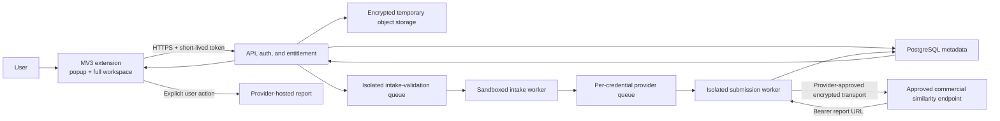
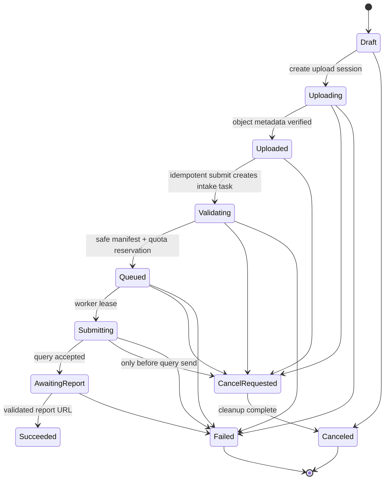

# Production Plan: Paid Code-Similarity Browser Extension

**Status:** Planning only — no product code has been implemented in this phase.
**Plan date:** 2026-07-28
**Working product description:** A polished Chrome extension that lets a user compare two or more source-code submissions and receive a provider-hosted similarity-report link.
**Commercial target:** USD $15 one-time purchase, subject to the commercial-permission and unit-economics gates below.
**Execution companion:** [`100-prompts.md`](./100-prompts.md) contains 100 ordered implementation prompts.

## 1. Executive decision

The repository is a useful MOSS protocol prototype, not an extension. The production product should consist of a Manifest V3 extension, an HTTPS API, durable queues, and locked-down workers that use a provider-approved encrypted transport. The public client’s current raw TCP behavior is research input, not an approved production architecture. The extension should offer a compact toolbar popup for shortcuts/status and a full extension page for the file-grouping workflow.

There are two mandatory go/no-go issues before implementation: commercial permission and transport confidentiality. Stanford states that public MOSS is for **non-commercial use** and directs commercial users to Similix. A paid wrapper must not launch against free MOSS accounts—even customer-supplied accounts—without written commercial authorization. The public service enforces 100 submissions per day per user; creating or rotating accounts to evade that limit is explicitly excluded. The reviewed public client also uses raw TCP without TLS, so a consumer launch involving student or confidential code requires an approved encrypted provider path or an explicit no-launch/pivot decision.

The product must be described as a **code similarity checker**, not an automatic plagiarism detector. MOSS compares a supplied corpus of source code, highlights potentially similar passages, and requires human review. It does not check a lone file against the Internet, does not establish intent, and is not an essay/PDF/DOCX plagiarism service.

## 2. Phase boundary

### Included now

- Audit and interpretation of the current repository.
- Product scope, user journeys, visual direction, architecture, data model, security posture, commercialization model, roadmap, and release gates.
- A sequenced file of 100 implementation prompts, each with objective, context, requirements, constraints, acceptance criteria, and verification.

### Explicitly not included now

- No extension manifest, UI, backend, database, payment integration, deployment, or MOSS submission has been created.
- No package dependencies have been installed or upgraded.
- No MOSS accounts have been created, pooled, shared, or tested.
- No commercial-use permission has been assumed.

## 3. Current repository assessment

The target `Matrix-AE/Moss-Plag-Extension` repository initially contains only its two-line product README; it has no implementation or repository license yet. This plan also audited the separate MIT-licensed [`node-moss` upstream repository](https://github.com/abdelhalimyasser/node-moss), whose runtime is centered on [`src/MOSS.ts`](https://github.com/abdelhalimyasser/node-moss/blob/main/src/MOSS.ts), as an integration reference rather than an already-imported product component.

| Area | Current state | Production implication |
|---|---|---|
| Runtime | Strict TypeScript using Node `net`, `fs/promises`, and `glob` | It cannot run inside a browser extension; the TCP work belongs in a backend worker or native companion. |
| MOSS behavior | Adds base/submission paths, sends options/files to `moss.stanford.edu:7690`, returns one report URL | Preserve this behavior behind a provider adapter, but rewrite/harden the protocol implementation. |
| Build | `tsup` is configured to emit CJS/ESM and declarations; the build was not run because dependencies are absent | Useful foundation, but packaging needs exports, engine constraints, validation, and CI. |
| Tests | `npm test` intentionally fails; no fixtures or mock server exist | A deterministic mock MOSS TCP server and protocol test suite are release blockers. |
| Browser product | No manifest, popup, side panel, full-page UI, storage, or browser tests | All extension surfaces must be designed and built. |
| Service product | No HTTPS API, job queue, worker isolation, database, object storage, or observability | A complete service layer is required for the low-friction hosted approach. |
| Commerce | No identity, payment, entitlement, device management, or refund flow | Entitlements must be enforced by the backend, not only by extension code. |
| Operations | No deployment, environments, alerts, runbooks, privacy policy, or support process | These are required before accepting payment or source code. |

### Known protocol-client defects to address

- `sendCommand()` installs a one-shot data listener even though responses may arrive in multiple chunks, which can leave a request hanging.
- There are no connect/read/write/query timeouts, abort handling, or carefully bounded retries.
- User IDs, comments, and filenames are placed into line-based commands without rejecting control characters, creating protocol-injection risk.
- Local paths are sent as filenames, leaking user directory information; path and filename normalization is insufficient.
- Files are fully buffered, directories can pass the initial `stat`, and there are no count/size/encoding limits or backpressure controls.
- Mutable arrays and a shared socket make concurrent or repeated `send()` calls unsafe.
- Cleanup can miss early connection failures or mask the original error.
- Result URLs are not validated against an allowlist.
- Directory mode exists, but there is no first-class model for grouping many files into one student/project submission.
- The hardcoded language list differs from the current official list and should become tested provider configuration.

Matrix-AE may choose a proprietary or open-source license for its original product code. If `node-moss` code is imported, its MIT copyright and permission notice must remain with reused or modified portions and distributed copies. Repository ownership alone does not grant rights to Stanford’s hosted service.

## 4. Product definition

### Launch audience

- Primary: adults (18+) comparing source code they own or are explicitly authorized to submit, including individual learners, developers, mentors, and independent educators.
- Pair and Batch modes compare user-supplied submission/project groups; they do not imply permission to upload classmates’ or students’ code.
- Institutional/classroom deployments, rosters, managed minors, organization roles, DPA terms, and education-record workflows are post-MVP and require a separate product/privacy review.

Launch documents must require authority to upload every file. The product must not knowingly target children or accept institution-controlled/student-record datasets under the self-serve personal license.

### Core value proposition

“Group authorized code, submit once, and get a provider-hosted similarity-report link without installing or running command-line scripts.”

### MVP workflows

1. **Pair Check:** exactly two logical submissions. Each submission can be one code file or a multi-file project.
2. **Batch Check:** two or more authorized logical submissions, such as project/version folders or safe ZIP archives.
3. **Base Code:** optionally add instructor-provided template/skeleton files so expected overlap can be ignored.
4. **Report Delivery:** show a successful result card with open/copy actions, an estimated-availability warning, and a human-review disclaimer.
5. **Recent Activity:** keep only minimal job/report metadata; never keep source content as history.

### Product rules

- At least two logical submissions are required. A single code file has no useful comparison corpus.
- One provider language is selected per job. Mixed-language uploads must be rejected or deliberately split into separate jobs after user confirmation.
- Individual code files, folders, and carefully inspected ZIPs are valid inputs. PDF, DOCX, images, executables, and arbitrary binary “documents” are not supported by MOSS.
- Filenames and folder paths are normalized into safe virtual paths before leaving the product.
- The UI says “similarity,” “potential match,” and “review,” never “caught cheating” or “plagiarism proven.”
- Report pages remain owned/served by the provider; the MVP returns a link and does not scrape, proxy, rewrite, or permanently archive the report.
- Opening or copying a bearer report URL can place it in browser history/sync or the system clipboard outside product control; forgetting it in the product cannot revoke the provider page or clear those external copies.

### Out of scope for MVP

- Internet-wide or repository-wide plagiarism search.
- Essay, prose, PDF, or Microsoft Word plagiarism checking.
- Automated disciplinary decisions, guilt labels, or definitive plagiarism verdicts.
- AI authorship detection.
- Learning-management-system integrations.
- Team/organization administration, shared classrooms, or bulk CSV rosters.
- Browser content scripts that read arbitrary page contents.
- Shared/rotating provider-account pools.

## 5. Mandatory commercial and provider gate

As of the plan date, the [official MOSS page](https://theory.stanford.edu/~aiken/moss/) says:

- Public MOSS is for non-commercial use; commercial users should contact [Similix](https://www.similix.com/).
- The service enforces 100 submissions per day per user.
- Anyone holding a result URL can access copies of submitted code.
- Results are typically deleted after approximately 14 days and can disappear earlier.
- MOSS identifies similarity; its scores are not proof of plagiarism.

No SLA was found in the public materials reviewed for this plan; the homepage warns users that overload can cause connection/result difficulties and asks them to retry later. The [official public Perl client](http://moss.stanford.edu/general/scripts/mossnet) uses raw TCP without TLS; the behavior of any commercial endpoint is unknown until confirmed in writing.

### Phase 0 questions requiring written answers

1. May a paid browser extension submit on behalf of customers?
2. Is a bring-your-own MOSS user ID allowed in a commercial product?
3. Is a managed service identity allowed, and may it be shared among licensed customers?
4. What daily, concurrent, file-count, byte-size, and automation limits apply; what event consumes one submission; and what reset window applies?
5. Are reseller/SaaS rights included, and may “MOSS” appear in product/store marketing?
6. Is TLS available for both source submission and report access, and what result URL schemes/hosts are authorized?
7. What SLA, support, retention, deletion, privacy, and data-processing terms apply?
8. May the product link directly to or programmatically inspect result pages?
9. What fees make a $15 one-time license economically sustainable, and which numeric hosted allowance can be promised?

### Account-model decision

| Model | UX | Status |
|---|---|---|
| Commercially licensed managed credentials | Easiest: purchase, upload, submit | Preferred only if the agreement explicitly allows it and unit economics work. |
| Customer-supplied numeric MOSS ID | One extra onboarding step | Allowed only if written commercial permission expressly covers this paid wrapper. Treat the ID as a secret. |
| Multiple developer-created accounts with rotation | Hidden from users | Rejected; it attempts to evade a deliberate per-user service limit and creates identity/security risk. |
| Approved alternative provider behind the same adapter | Similar UX | Required fallback if commercial MOSS permission is unavailable. |
| Signed native companion | More installation friction, less hosted file handling | Secondary architecture if direct licensed submission is allowed and hosted lifetime costs are not viable. |

**Go criterion:** written authorization plus acceptable technical/data/commercial terms.
**Pivot criterion:** use a properly licensed or self-hosted alternative provider through the adapter.
**Stop criterion:** no lawful provider path or no sustainable unit economics; do not sell the MOSS-backed product.

For a self-serve product that accepts student or confidential code, lack of encrypted transport for both upload and report access is a recommended no-launch condition, not a disclosure-only issue. If Prompt 5 returns **stop**, implementation stops. If it returns **pivot** or selects the native-companion path, the hosted-relay backlog in `100-prompts.md` must be regenerated against the approved architecture before execution continues.

Account registration must remain a user-controlled external process unless an agreement provides an official API. Do not automate registration emails. If BYO IDs are approved, onboarding should request only the issued numeric user ID, explain where it comes from, validate format, and never ask for an email password.

## 6. User experience and information architecture

### Extension surfaces

- **Toolbar popup (approximately 400 × 560):** license/account state, “New check,” current job progress, and the last three report entries. It is a launcher and status surface, not the full uploader.
- **Full extension page:** the primary workspace for grouping files/projects, selecting options, reviewing privacy details, monitoring progress, and viewing history/settings.
- **Optional Chrome side panel:** a post-MVP convenience surface if research confirms that persistent in-browser monitoring adds value. Chrome’s official [`sidePanel` API](https://developer.chrome.com/docs/extensions/reference/api/sidePanel) requires MV3 and an explicit permission.
- **Hosted checkout/account page:** payment, email verification, device management, refund/support links, and privacy/legal pages.

### Golden user journey

1. Install and open the extension.
2. See a concise promise and three disclosures: code goes to a third-party provider, report links are bearer secrets, and similarity is not proof of plagiarism.
3. Explore a synthetic demo or create/validate a local draft without paying; no selected source leaves the device during preview.
4. Choose Pair Check or Batch Check, add a comparison title, and add two or more groups by file, folder, or safe ZIP.
5. Select/confirm language, add optional base code, and review safe defaults or advanced settings.
6. Purchase/restore the $15 license and activate the current device only when ready to submit.
7. Connect an approved provider account only if the commercial account model requires it.
8. Review group/file counts, bytes, exclusions, numeric allowance/quota impact, retention, transport, and consent.
9. Submit and see deterministic stages: uploading → validating → queued → submitting → waiting → ready.
10. Open/copy the bearer link with estimated-availability/browser-history/clipboard warnings, forget only the stored URL, or delete terminal job history; a rerun restores empty group structure/settings and requires file reselection.

### Required empty, progress, and error states

- No files, only one submission group, empty group, duplicate files, mixed languages, unsupported language, binary/UTF-16 content, oversized file/job, too many files, invalid folder structure.
- Corrupt ZIP, nested archive, path traversal, symlink, decompression bomb, or encrypted archive.
- Offline browser, interrupted upload, expired upload session, duplicate submit click, canceled job.
- Invalid provider ID, quota exhausted, upstream overloaded, TCP timeout, ambiguous upstream completion, invalid result URL.
- Report past its estimated availability or already removed by the provider, revoked/refunded license, expired session, or device limit reached.

Errors must be actionable and distinguish retryable product failures from upstream or user-input failures. Ordinary browser `File` objects do not survive restart. MVP persists only mode, language, settings, generic group count, and a random draft ID in `chrome.storage.local` for at most 24 hours—never title, group labels, filenames, paths, source, or hashes. Users reselect and fully revalidate files. Purge the draft on upload start, logout, explicit discard, or TTL. An opaque active job ID may remain locally until terminal state, then is purged within 24 hours; authenticated server history supports later recovery.

### Modern Gen-Z visual direction

- Dark-first near-black canvas with elevated navy/charcoal surfaces; light theme follows system settings by launch.
- Electric lime/mint primary accent and violet secondary accent, used selectively instead of flooding every surface with gradients.
- Locally bundled Geist/Inter-style sans serif; clear numeric styles for counts and progress. No remotely loaded fonts or UI code.
- Rounded 14–18 px cards, 8 px spacing grid, compact status chips, generous drag/drop target, thin borders, and soft depth.
- Friendly but trustworthy microcopy: “Packing files,” “Submitting for similarity analysis,” and “Your report link is ready.” Never use “secure/private” for provider transport or report availability unless the approved endpoint actually guarantees it.
- Motion in the 180–240 ms range, limited to state continuity; fully respect `prefers-reduced-motion`.
- WCAG 2.2 AA contrast, visible focus rings, complete keyboard operation, screen-reader labels/live regions, 44 px pointer targets, and no color-only status meaning.
- Results use calm, neutral language. Avoid sirens, police metaphors, shame language, or gamified accusations.

## 7. Recommended architecture

The low-friction recommendation is a hosted relay. The browser sends files over HTTPS; an isolated server worker uses the contract-approved encrypted provider transport and keeps long-running work independent of MV3 view/service-worker lifetimes.



### Proposed monorepo target

```text
apps/
  extension/       # WXT + React + TypeScript MV3 popup and full-page workspace
  api/             # HTTPS API, auth, entitlements, jobs, upload coordination
  intake-worker/   # No provider credentials/egress; archive and text validation
  submission-worker/ # Approved provider credentials/egress; immutable manifests only
packages/
  moss-client/     # Hardened immutable provider adapter derived from this package
  contracts/       # Schemas, API/job/error types, generated client
  ui/              # Tokens and accessible extension components
  config/          # Lint, TypeScript, tests, environment validation
infra/             # Reproducible environments, storage lifecycle, queue, database
docs/              # ADRs, threat model, privacy map, runbooks, release evidence
```

WXT is the recommended extension framework because its [official documentation](https://wxt.dev/) supports TypeScript, React/Vite integration, MV3, multiple extension entry points, and multiple browsers. Chrome is the launch target. Edge compatibility/listing follows a stable Chrome release; Firefox is a later milestone.

### Service responsibilities

- **Extension:** 24-hour minimal draft shell (mode/language/settings/group count/random ID only), grouping UX, reselection/revalidation, upload orchestration, polling, and terminal+24-hour active-job-ID purge; title, labels, names, paths, hashes, source, and `File` objects are never persisted locally.
- **API:** authentication/session lifecycle, license enforcement, capabilities, upload sessions, cancel/result-forget/terminal-history-delete transitions, idempotency, quota, account data rights, and redacted audits.
- **Object storage:** encrypted source blobs with short lifecycle fallback; objects are explicitly deleted immediately after terminal processing.
- **Intake queue/worker:** isolated safe extraction, text/encoding validation, normalized immutable manifests, cancellation checks, and cleanup before provider quota is consumed.
- **Provider queue:** fair scheduling per approved credential, concurrency caps, delayed retry only where safe, and backpressure during upstream outages.
- **Submission worker:** non-root isolated process, immutable provider request, allowlisted egress, protocol timeouts, result-host validation, and guaranteed cleanup.
- **Database:** user/license/device records and non-source job metadata; encrypted provider IDs and report URLs; no code bodies.
- **Payment webhooks:** authoritative purchase, refund, chargeback, and entitlement transitions.

### Why the existing package cannot live in the extension

Manifest V3 pages and service workers do not expose Node’s raw `net` sockets, `fs/promises`, or `glob` filesystem behavior. In addition, a popup can close at any time and MV3 background workers are suspended. Long-running post-upload state must live in the backend and be recovered by polling. Pre-upload drafts can recover metadata only; users reselect local files after a restart.

## 8. Domain model and job behavior

### Core entities

- **User:** internal ID, verified email only if required for purchase/recovery, self-serve eligibility/age acknowledgement, consent timestamps.
- **Entitlement:** provider purchase ID, product/version, active/refunded/chargeback status, numeric hosted-allowance policy/version.
- **Device:** opaque installation key, user-visible nickname, created/last-seen/revoked timestamps; never raw hardware fingerprinting.
- **ProviderCredential:** owner, provider type, encrypted numeric ID/reference, validation state, usage counters, never returned in full.
- **Job:** owner, user title, mode, language, provider, settings, consent version, status, counts/bytes, quota-consumption point, idempotency key, error code, timestamps.
- **SubmissionGroup:** stable random ID, local display label, safe virtual root, ordinal; contains one or many files.
- **FileObject:** temporary object key, sanitized relative path, byte size, encoding, hash, group/base-code role, deletion state.
- **ResultSecret:** encrypted report URL, allowlisted scheme/host/path, received time, estimated-availability boundary, forgotten time, and access status; it does not assert provider availability.
- **AuditEvent:** actor, coarse action, timestamp, request ID, non-sensitive outcome; no source names, content, IDs, or URLs.

### Job state machine



An “ambiguous upstream” error is terminal and must not be blindly retried: if the query may already have been accepted, retrying could create a second provider submission and consume quota. Users receive a clear explanation and a deliberate resubmit action. Cancellation is guaranteed only before the provider query is sent; after acceptance it becomes “too late to cancel,” the reserved quota is consumed, and cleanup/status continue. A succeeded job remains succeeded. Because MVP does not probe report pages, “past estimated availability” is separate display metadata, not an `Expired` job state.

### API outline

| Method | Route | Purpose |
|---|---|---|
| `GET` | `/v1/capabilities` | Approved provider, languages, limits, retention, feature flags, client compatibility. |
| `POST` | `/v1/auth/exchange` | Exchange a single-use, 10-minute, device-bound email magic-link nonce/code for scoped tokens; purchase IDs are not authentication. |
| `POST` | `/v1/auth/refresh` | Rotate a refresh session and issue a short-lived access token. |
| `POST` | `/v1/auth/logout` | Revoke the current refresh session/device token. |
| `POST` | `/v1/auth/logout-all` | Revoke all refresh sessions after re-authentication/compromise recovery. |
| `GET` | `/v1/me/entitlement` | Current paid/refund/device status and numeric hosted allowance. |
| `POST` | `/v1/me/export` | Create an owner-scoped export of eligible account metadata. |
| `GET` | `/v1/me/export/:requestId` | Read export status and retrieve a short-lived protected artifact. |
| `DELETE` | `/v1/me` | Start verified account deletion with disclosed legal/payment retention exceptions. |
| `GET` | `/v1/me/deletion/:requestId` | Read deletion propagation, exceptions, and completion status. |
| `GET` | `/v1/devices` | List the owner’s opaque active/revoked device records. |
| `POST` | `/v1/devices/activate` | Activate this installation under the device limit. |
| `POST` | `/v1/devices/:id/deactivate` | Self-service device removal. |
| `PUT` | `/v1/provider-connection` | Store/update an approved provider ID using envelope encryption. |
| `DELETE` | `/v1/provider-connection` | Delete the saved provider ID after dependency checks. |
| `POST` | `/v1/jobs` | Create a titled draft with mode, language, settings, groups, consent version, and idempotency key. |
| `POST` | `/v1/jobs/:id/uploads` | Issue bounded upload instructions for an exact approved API/upload origin. |
| `POST` | `/v1/jobs/:id/submit` | Atomically create one intake-validation task; validation later reserves quota and enqueues provider work. |
| `GET` | `/v1/jobs/:id` | Poll a redacted job/result projection. |
| `GET` | `/v1/jobs` | Paginate the owner’s metadata-only recent history. |
| `POST` | `/v1/jobs/:id/cancel` | Request cancellation; report whether provider submission can still be prevented. |
| `POST` | `/v1/jobs/:id/result/forget` | Erase the encrypted bearer URL while retaining minimal non-link job history; it cannot revoke external copies. |
| `DELETE` | `/v1/jobs/:id` | Delete a terminal job’s product history after cleanup; active jobs must be canceled and reach a terminal state first. |

Every mutating route uses schema validation, authenticated ownership checks, request IDs, rate limits, and idempotency where repetition is possible. API errors use stable machine codes plus safe user messages; internal/provider text is never reflected raw.

### Provider adapter contract

The application depends on a provider-neutral interface such as `validateCapabilities`, `submitSimilarityJob`, `classifyError`, and `validateResult`. Product/job types must not expose socket-protocol details. A commercial MOSS endpoint, approved BYO MOSS mode, native companion, or licensed alternative can implement the same contract.

The MOSS adapter must support:

- Immutable per-job configuration and no shared mutable socket state.
- Two or more logical submission groups, multi-file directory mode, and zero or more base files.
- Safe virtual names rather than original absolute paths.
- Current approved languages as provider configuration, including aliases and extension mappings.
- UTF-8 normalization or explicit rejection of unsupported encodings/binary data.
- Connect/read/write/overall deadlines, cancellation, line-fragment parsing, backpressure, and typed failure stages.
- Conservative retries only before a request could have consumed upstream quota.
- Exact hostname/port egress restrictions and result URL scheme/hostname/path validation.
- Mock-server tests for fragmentation, delay, disconnect, malformed responses, backpressure, and ambiguous completion.

## 9. Security, privacy, and abuse controls

### Data handling

| Data | Classification | Storage and retention |
|---|---|---|
| Source files and safe virtual names | Highly sensitive customer content | Encrypted temporary objects; delete immediately after success/failure/cancel, with a short automatic lifecycle as a backstop. Never place in logs/backups. |
| Numeric provider ID | Secret credential/identifier | Prefer per-use entry; if saved, envelope-encrypt with KMS, restrict decrypt to workers, redact everywhere. |
| Provider report URL | Bearer secret containing access to code | Encrypt at rest, reveal only to the owner, exclude from telemetry/referrers/support tools, and forget from product storage on request/policy; this cannot revoke the provider page or external copies. |
| Email/payment customer IDs | Personal/commercial data | Store the minimum required for entitlement/recovery and follow processor/legal retention rules. No card data enters the product. |
| Job metadata | Sensitive usage metadata | Store counts, language, state, timestamps, coarse errors; configurable retention and user deletion. |
| Product telemetry | Low-sensitivity only by design | Opt-in/region-appropriate consent; never filenames, code, URLs, provider IDs, comments, or local paths. |

The exact maximum temporary-retention window cannot be finalized until provider terms and infrastructure are chosen. The default design principle is immediate explicit deletion plus a lifecycle backstop measured in hours, not days.

### Required controls

- TLS 1.2+ from extension to API/upload origin. The official public Perl client’s provider leg is raw TCP without TLS; require an approved encrypted submission/report path for launch with student/confidential code or pivot/stop.
- Strict MV3 CSP with bundled code/assets only; no remote executable code, `eval`, or dynamically injected scripts.
- Minimal permissions: `storage` plus the exact API host and, only for direct signed uploads, an exact dedicated upload host; add `sidePanel` only if it ships. No browsing-history, all-sites, tabs, or page-content permission for MVP.
- Email magic-link authentication: single-use 10-minute device-bound nonce/code, 15-minute access token, rotating/reuse-detecting 30-day refresh session in `chrome.storage.local` (never sync), logout-all, profile-reset restore after email verification, and compromised-email recovery. Purchase IDs never authenticate; PKCE is reserved only for a future authorization-code provider.
- CSRF protection on hosted pages, exact origins/CORS, session/device inventory, and server-side entitlement/ownership checks on every protected route.
- Key separation and rotation using a managed KMS; production secrets never in extension bundles, repository, logs, or generic environment dumps.
- Rate limiting per user, license, device, IP risk signal, and provider credential; atomic quota reservation and release rules.
- ZIP-slip, symlink, archive-depth, compression-ratio, file-count, expanded-byte, and filename/control-character defenses.
- Files are never executed. Worker containers are non-root, read-only where possible, resource-limited, short-lived, and isolated from internal networks.
- Egress allowlist for the approved provider host/port plus required storage/telemetry endpoints; no arbitrary destinations.
- Constant-time signature verification for webhooks, replay protection, and an append-only entitlement audit trail.
- Dependency/SAST/secret/container scans, signed artifacts, locked dependencies, protected releases, and emergency revocation.
- Abuse response for leaked licenses, automated scraping, quota attacks, malicious archives, and provider outages without silently rotating identities.

### User-facing privacy requirements

- Obtain an explicit final-review acknowledgement before the first submission and whenever material processing terms change.
- State the actual approved transport. The reviewed public MOSS client uses a non-TLS TCP submission leg; do not accept student/confidential code through that path in the recommended launch posture.
- State that anyone with the report link can view the submitted code and that the link should be treated like a password.
- State that provider reports are typically available for about 14 days but may disappear earlier; do not promise availability.
- Explain that open/copy can leave the URL in browser history/sync or the system clipboard outside product control.
- Let the user cancel eligible work, forget only a stored bearer URL, delete terminal job history, delete provider credentials, export/delete the account, and understand all external/payment-retention limitations.
- Require the user to confirm authorization to submit all included code.
- Publish clear privacy, terms, acceptable-use, refund, retention, subprocessors, and support documents before beta.

## 10. $15 one-time commercial model

### Recommended offer

- Free installation, synthetic demo, and local draft validation; payment is required only before the first byte is uploaded.
- The **$15 one-time personal license** creates a non-expiring entitlement record for the purchased core feature set on up to two active devices; because Web Store updates are automatic, future clients must preserve that legacy feature set or provide the approved migration/export remedy.
- Hosted submission must use a prominently disclosed numeric allowance (for example, successful provider submissions included/period and renewal behavior) approved by the early unit-economics gate; “reasonable” or hidden fair use is not acceptable.
- A non-expiring entitlement does not promise indefinite backend operability. No checkout, quota implementation, or store claim may ship until allowance, hosted-service/EOL notice term, security/compatibility update term, major-version behavior, refund window, shutdown/migration remedy, and provider continuity are measurable and approved.
- Checkout runs on a hosted PCI-compliant payment page. The backend consumes signed webhooks and owns entitlement state.
- A restore-purchase path uses verified email or purchase/license proof; the extension never stores payment-card information.
- Refunds and chargebacks automatically change entitlements, with a user-friendly grace/error state and auditable support override.

### Pricing gate

Before architecture implementation and again before checkout, model payment fees, taxes/VAT handling, provider licensing, storage/egress, queue/worker/API/database costs, support/refund rates, fraud, and a multi-year service reserve. Then approve one measurable fulfillment model:

1. Keep $15 for the extension/native companion while users use an expressly approved provider account.
2. Keep $15 with an explicit numeric hosted-submission allowance funded by measured costs.
3. Change pricing before launch rather than selling an unsustainable “unlimited lifetime” promise.

The current planning phase intentionally does not invent the allowance without a commercial quote. Prompt 6 is a blocking feasibility decision: it must replace the placeholder with exact numbers and regenerate downstream quota/payment acceptance criteria before Prompt 10 selects an architecture.

Provider permission and payment-provider choice are separate decisions. Select the merchant-of-record or payment stack through an ADR covering supported countries, tax handling, refunds, webhook quality, payout/fraud risk, and fees; do not couple the extension directly to one vendor SDK.

## 11. Reliability and observability

### Provisional service objectives

- API availability target: 99.5% monthly during initial paid release, excluding clearly identified upstream-provider outages.
- End-to-end successful-report rate and p95 time-to-report are measured including upstream outcomes, with product-versus-provider attribution shown separately.
- No acknowledged source object remains past the documented deletion backstop; deletion verification is a release SLO.
- Source deletion lag, cost per successful report, queue age, and upstream-attributed failure rate have explicit launch thresholds set after load/beta evidence.
- 100% of jobs have a traceable state transition and request/job correlation ID without sensitive payloads.
- Duplicate submission caused by product retry: zero known incidents; idempotency is mandatory.
- User-visible status freshness: polling reflects backend state within 10 seconds during active jobs under normal conditions.

These are initial engineering targets, not customer promises or an upstream SLA.

### Required telemetry

- Metrics: job states/latency by stage, validation rejections by coarse code, queue depth/age, worker saturation, provider failures/timeouts, quota reservations, deletion lag/failures, license events, API latency/error rate.
- Traces: extension request → API → storage → queue → worker → provider stage, with redacted attributes.
- Logs: structured event codes and IDs only; automated tests must assert that source, filenames, provider IDs, report URLs, tokens, and payment data are absent.
- Alerts: deletion backlog, invalid-result spike, provider circuit open, quota nearing limit, queue-age breach, webhook failures, elevated auth failures, database/storage errors.
- Status/support: public incident language that separates product outage from upstream-provider degradation without exposing provider credentials.

### Disaster recovery

- Define approved RPO/RTO for metadata, entitlements, credentials, and job state; source objects must never enter backups.
- Provision environments through reviewed infrastructure as code with isolated development/staging/production identities, networks, keys, and data.
- Test database restore, queue reconstruction, object-lifecycle recovery, KMS/key recovery, region/service failure, safe migrations, and backend rollback.
- A restore must not resurrect forgotten result URLs, deleted credentials, revoked sessions, or source content beyond documented/legal exceptions.

## 12. Quality strategy

### Test layers

- **Unit:** schemas, path/filename normalization, language detection, grouping, limits, state transitions, quota accounting, entitlement rules, redaction, URL allowlists.
- **Protocol:** local mock TCP server covering fragmented responses, slow/no response, backpressure, disconnects, malformed lines, quota-like errors, cancellation, and ambiguous completion.
- **Integration:** API/database/object storage/queue/worker with provider fake; verify idempotency, ownership, deletion, webhook replay protection, and terminal states.
- **Extension component:** uploader, group editor, option forms, progress, error recovery, result cards, settings, keyboard/screen-reader behavior.
- **End to end:** load the packaged MV3 extension in Chrome, activate a test entitlement, upload fixtures, survive popup closure/browser restart, finish a fake job, open/copy a safe result.
- **Security:** malicious ZIP corpus, traversal/control characters, oversized payloads, token/license abuse, IDOR, rate limits, dependency/secret/container scanning, CSP/permission audit.
- **Accessibility and visual:** axe/manual screen reader, keyboard-only, zoom 200%, contrast, reduced motion, dark/light themes, fixed screenshots at supported viewport sizes.
- **Performance/resilience:** maximum permitted batch, concurrent users, queue saturation, worker crash, storage failure, provider outage/circuit breaker, deletion recovery, backup restore, and regional dependency failure.

Tests against live MOSS must be rare, explicitly authorized, quota-aware, non-sensitive, and never part of normal CI.

### Release quality gates

- Type-check, lint, unit, integration, protocol, packaged-extension E2E, accessibility, and security scans all pass.
- No critical/high known vulnerability; medium findings have documented owners and risk decisions.
- Privacy data map, threat model, provider permission, licenses/notices, runbooks, rollback, deletion evidence, store disclosures, and support/refund paths are complete.
- A clean install and purchase-restore path works on the supported Chrome release matrix.
- Real beta users can complete Pair and Batch checks without developer intervention.

## 13. Delivery roadmap

Estimates are provisional for one experienced full-stack engineer and can overlap where dependencies permit. Commercial/provider response time is not included.

| Phase | Indicative time | Deliverables | Exit gate |
|---|---:|---|---|
| 0. Commercial feasibility | External dependency | Written provider rights/limits/data/transport terms; measurable $15 offer and cost model; hosted/native/pivot decision | Written go/pivot/stop; numeric allowance; encrypted path; no account rotation. |
| 1. Product foundation | 1 week | Monorepo, contracts, CI, environment validation, ADRs, threat model, design tokens | Reproducible builds and approved architecture. |
| 2. Provider foundation | 1–2 weeks | Hardened immutable client, provider adapter, mock TCP server, full protocol tests | Deterministic tests pass; no live dependency in CI. |
| 3. Backend job pipeline | 2 weeks | API, auth skeleton, encrypted uploads, metadata DB, queue/worker, state machine, deletion | Fake-provider E2E succeeds; retention and idempotency verified. |
| 4. Extension experience | 2–3 weeks | MV3 popup/full page, onboarding, Pair/Batch grouping, language/base code, progress/results/settings | Packaged extension completes fake-provider journey accessibly. |
| 5. Commerce and account connection | 1–2 weeks | Approved terms/privacy, hosted checkout, signed webhooks, entitlement/device flows, provider connection | Purchase/restore/refund/device and numeric quota flows pass in sandbox. |
| 6. Security and operations | 1–2 weeks | IaC, backup/restore, isolation, egress, rate limits, redaction, metrics/alerts, policies, runbooks, store assets | Security/privacy/DR/reliability release gates pass. |
| 7. Private beta | 1–2 weeks | Small invited adult cohort, minimum support desk, load/outage/restore drills, measured costs and UX | KPIs, support, incident, deletion, and cost evidence meet beta thresholds. |
| 8. Paid rollout | Staged | Store review, 5%→25%→100% rollout, monitoring, support/refunds | Stable metrics and no unresolved severity-1 issue. |

## 14. Beta and launch measurement

Collect only privacy-safe aggregates with consent where required.

- Activation completion rate and time to first valid draft.
- Pair/Batch draft-to-submit conversion.
- Validation failure rate by stable coarse error code.
- Job success rate split into product, user, and upstream outcomes.
- Median/p95 time by upload, queue, submit, and report stages.
- Restore-purchase success, refund rate, device-limit support rate, and license fraud signal.
- Source deletion success/lag and report-metadata deletion requests.
- Accessibility/support issues and crash-free extension sessions.
- Cost per successful submission and projected support/infrastructure reserve per license.

Never collect filenames, source text/hashes usable as fingerprints, comments, provider IDs, result URLs, original local paths, or match contents as analytics.

## 15. Principal risks and mitigations

| Risk | Impact | Mitigation |
|---|---|---|
| Commercial MOSS permission denied or unclear | Product cannot ship compliantly under the published terms without written authorization | Phase 0 go/no-go; provider adapter; licensed/self-hosted pivot. |
| Account rotation appears to solve quota | Terms/policy, service abuse, sudden shutdown | Explicit prohibition, per-credential fair queue, honest quota UI, commercial capacity agreement. |
| $15 lifetime economics fail | Unsustainable service/support | Measure full cost, numeric allowance, native option, and approve price/term before architecture and sale. |
| Official public-client provider leg is plaintext | Source confidentiality exposure | Make encrypted submission/report paths a recommended launch gate for student/confidential code; obtain commercial TLS or pivot/stop. |
| Result URL leaks | Anyone with link can view code | Treat as bearer secret, encrypt, redact, no analytics/referrer, explicit sharing warning. |
| Provider removes report early/outage | User dissatisfaction | Keep job succeeded, label only estimated availability, use upstream-specific statuses, circuit breaker, and honest support copy. |
| Malicious/huge archives | Resource exhaustion or compromise | Strict archive/file limits, safe extraction, isolation, no execution, rate limits. |
| MV3 popup/service worker closes | Lost progress perception | Backend-owned post-upload jobs, idempotency, metadata-only draft recovery with file reselection, and polling. |
| Similarity presented as guilt | Harmful/incorrect decisions | Human-review disclaimer throughout product and marketing; neutral terminology. |
| Educational/student privacy obligations | Legal/reputational harm | Minimize data, consent/authority attestation, deletion, legal review, institution-specific terms later. |
| Fork diverges from upstream client | Maintenance burden | Preserve attribution, isolate adapter, protocol conformance tests, scheduled upstream review. |

## 16. MVP definition of done

The product is production-ready only when all statements below are true:

- Written commercial permission and approved account model are archived and reflected in configuration/copy.
- Pair Check handles two one-file or multi-file submission groups correctly.
- Batch Check handles the approved maximum number of logical groups and files with deterministic safe grouping.
- Optional base code and provider options work with documented safe defaults.
- The extension is MV3, requests only justified permissions, and recovers active jobs after its UI closes/reopens.
- Every upload is authenticated, bounded, scanned/validated as text, safely normalized, and deleted after terminal processing.
- The backend enforces ownership, sessions, entitlement, devices, published numeric allowance/provider quota, idempotency, rate limits, and concurrency.
- Provider communication has timeouts, cancellation, backpressure, typed errors, response fragmentation support, strict egress, and result validation.
- Successful output is a bearer-link card with open/copy/forget-URL/delete-history actions, estimated-availability and external-copy limitations, and no definitive plagiarism claim.
- Payment, restore, session revocation, refund/chargeback, device deactivation, account export/deletion, and support paths work end to end.
- Automated quality gates, privacy/security documentation, monitoring/alerts, runbooks, rollback, and staged-release controls are complete.
- Store listing, screenshots, privacy disclosures, terms, refund policy, and support materials accurately match runtime behavior.

## 17. Decisions fixed by this plan

- Planning only in the current phase.
- Code similarity rather than general document plagiarism.
- Two modes: Pair and Batch; both operate on logical submission groups.
- Popup plus full extension workspace; side panel is optional later.
- MV3, TypeScript, React, and a provider-neutral backend architecture.
- Chrome is the launch browser; Edge and Firefox are later compatibility milestones.
- Folder/ZIP intake, dark and system-following light themes, and metadata-only draft recovery with file reselection are MVP requirements.
- Backend owns post-upload state; source is ephemeral; report links and provider IDs are bearer/credential secrets.
- $15 creates a non-expiring personal entitlement record for the purchased core feature set and two devices; hosted operability/EOL, allowance, updates, refunds, auto-update/major-version behavior, and remedy are fixed before sale.
- Self-serve launch is for adults (18+) submitting code they own or are authorized to use; institutional/minor workflows are post-MVP.
- No automatic provider-account registration, credential bundling, pooling, or rotation.
- No launch without written commercial permission.

## 18. Open decisions to resolve in Phase 0/1

- Commercial MOSS/Similix terms and whether managed or BYO credentials are authorized.
- Hosted relay versus signed native companion based on data terms, transport security, UX, and lifetime cost.
- Exact file, expanded-archive, group, job, provider-submission, concurrency, allowance, and history limits.
- Final payment/merchant-of-record, tax, refund window, supported countries, numeric allowance, update/support term, and shutdown remedy.
- Final product name, trademark clearance, domain, and whether provider names may appear in the brand.
- Exact maximum retention for temporary objects and metadata by region.
- Whether the optional side panel earns a post-MVP place after user research.
- Minimum supported browser/OS versions and accessibility test matrix.

## 19. Authoritative references

- [Stanford MOSS: service purpose, commercial restriction, limits, registration, languages, and report privacy](https://theory.stanford.edu/~aiken/moss/)
- [Official MOSS script index](http://moss.stanford.edu/general/scripts.html)
- [Official public MOSS Perl client (raw TCP protocol reference)](http://moss.stanford.edu/general/scripts/mossnet)
- [Similix commercial website](https://www.similix.com/)
- [Stanford website terms](https://www.stanford.edu/terms)
- [Stanford computer and network usage policy](https://adminguide.stanford.edu/chapters/computing/computer-and-network-usage/computer-and-network-usage-policy)
- [Chrome Manifest V3 reference](https://developer.chrome.com/docs/extensions/reference/manifest)
- [WXT official documentation](https://wxt.dev/)
- Product baseline: [`README.md`](./README.md)
- Audited integration reference: upstream [`README.md`](https://github.com/abdelhalimyasser/node-moss/blob/main/README.md), [`src/MOSS.ts`](https://github.com/abdelhalimyasser/node-moss/blob/main/src/MOSS.ts), [`package.json`](https://github.com/abdelhalimyasser/node-moss/blob/main/package.json), and [`LICENSE`](https://github.com/abdelhalimyasser/node-moss/blob/main/LICENSE)

## 20. Implementation handoff

Execute [`100-prompts.md`](./100-prompts.md) in order. Each prompt is intentionally bounded and has its own acceptance and verification lines. Prompt 5 **stop** ends execution; **pivot/native** requires a regenerated architecture-specific backlog. Prompt 6 fixes the measurable $15 offer before Prompt 10 selects architecture. No live-provider work begins without written permission and an approved encrypted path. Every implementation change remains reviewable, tested, documented, and reversible.
